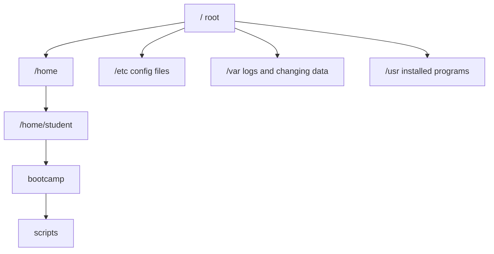

# Lecture Notes: Linux Terminal To First Script

## Big Idea

Linux is the operating system used behind many servers, cloud systems, developer tools, cybersecurity labs, and automation workflows.

You do not need to memorize everything. You need to learn how to ask the system where you are, what files exist, what permissions they have, and how to run a script.

## Linux Vocabulary

| Word | Meaning |
| --- | --- |
| Kernel | Core part of the operating system that talks to hardware |
| Distribution | A packaged Linux operating system, such as Fedora, Ubuntu, Debian, or Rocky |
| Shell | Program that reads your commands, often Bash |
| Terminal | Window where you type shell commands |
| Filesystem | Organized tree of folders and files |
| Package manager | Tool that installs software, such as `dnf` on Fedora |

## Filesystem Map



## Commands You Need Today

| Command | Use |
| --- | --- |
| `pwd` | print current folder |
| `ls` | list files |
| `ls -la` | list files with hidden files and permissions |
| `cd folder` | move into a folder |
| `cd ..` | move up one folder |
| `mkdir name` | create a folder |
| `touch file.txt` | create an empty file |
| `cat file.txt` | print file contents |
| `nano file.txt` | edit a file in the terminal |
| `cp old new` | copy a file |
| `mv old new` | move or rename a file |
| `rm file` | remove a file |
| `chmod +x script.py` | make a script executable |
| `python3 script.py` | run a Python script |

## Permissions

When you run `ls -l`, you may see something like:

```text
-rwxr-xr-- 1 student student 120 May 5 10:20 hello.py
```

Read it in pieces:

- first character: file type
- `r`: read
- `w`: write
- `x`: execute
- owner permissions
- group permissions
- everyone else permissions

## Why Developers Care

Developers use Linux because many real applications run on Linux servers. Even if you build on Windows or macOS, the app often gets deployed on Linux in a cloud environment.

Today is about confidence: create files, run code, inspect output, and explain what happened.
