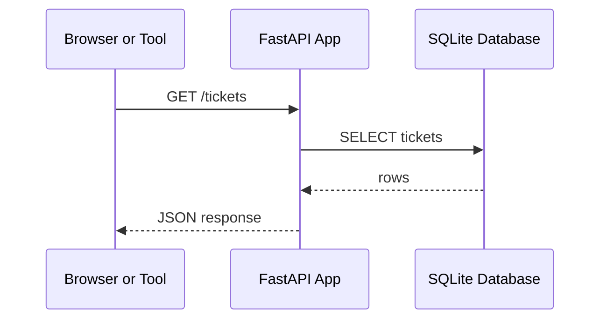

# Lecture Notes: API, Debugging, And Project Explanation

## Big Idea

An API lets programs talk to other programs.

Websites, phone apps, dashboards, AI tools, and automation scripts often call APIs to request or save data.



## Web App Vs API

| Type | Main Job |
| --- | --- |
| Website | shows pages for humans |
| API | sends and receives data for software |
| Backend | server-side code that handles logic and data |
| Database | stores persistent data |

## HTTP Methods

| Method | Meaning | Example |
| --- | --- | --- |
| `GET` | read data | `GET /tickets` |
| `POST` | create data | `POST /tickets` |
| `PUT` or `PATCH` | update data | change ticket status |
| `DELETE` | delete data | remove a ticket |

## JSON

APIs commonly use JSON:

```json
{
  "student_name": "Ari",
  "category": "password",
  "priority": "normal",
  "issue": "password reset needed"
}
```

## Debugging

When something breaks, slow down and collect evidence:

1. What command did you run?
2. What error appeared?
3. What file and line number does the error mention?
4. Did the server start?
5. Did the request reach the server?
6. Did the database file exist?

## Project Explanation

A beginner interview explanation can be simple:

> I built a small helpdesk ticket API on Linux using Python and FastAPI. I used SQLite to store tickets, tested endpoints in the browser docs, and used terminal commands to run and debug the app.

You are not claiming to be an expert. You are showing that you can learn tools, run a project, and explain the parts.
